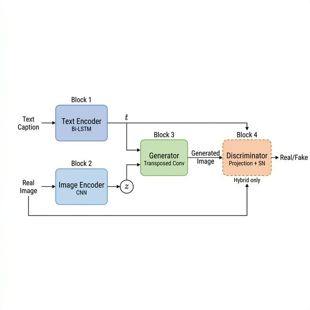

# Hybrid CVAE-GAN Text-to-Image Notebook

This repository centers on one notebook:
- [Hybrid_CVAE_GAN_Full_Comparison.ipynb](Hybrid_CVAE_GAN_Full_Comparison.ipynb)

The notebook started as an end-to-end prototype for text-conditioned image generation, then was upgraded into a more structured experiment pipeline with reproducible training, baseline comparison, checkpointing, and qualitative/quantitative reporting.

## 1) Purpose of This Notebook

The notebook is designed to answer one practical question:

**Can a text-conditioned hybrid CVAE + GAN pipeline generate images that better match prompts than a CVAE-only baseline?**

It aims to provide:
- A complete training/evaluation workflow in one place.
- A baseline-vs-hybrid comparison under the same conditions.
- Reproducible artifacts (history logs, checkpoints, summary CSVs, and visual grids).

## 2) How We Got Here (Development Journey)

### Phase A: Prototype Sandbox
Initial notebook cells built a full architecture prototype with:
- Dummy local data (small synthetic set).
- Caption tokenization and vocabulary construction.
- Text encoder + image encoder + generator + discriminator wiring.
- Basic generation and helper metric functions.

This phase was useful for integration testing and debugging, but not scientifically reliable for conclusions.

### Phase B: Research-Grade Upgrade Section
A dedicated upgrade section was added to convert the notebook from demo to experiment:
- Real dataset pipeline with deterministic train/val split.
- Baseline and hybrid runs in a single protocol.
- Checkpointing and CSV history export.
- Fixed random seeds and deterministic flags.
- FID/IS evaluation utilities and qualitative comparison grids.

### Phase C: Diagnostics and Interpretation
Additional cells were added for:
- Side-by-side generation comparisons (baseline vs hybrid).
- Diversity grids (same prompt, multiple seeds).
- Train data sampling visualization.
- Class/caption distribution summary from actual train split.

## 3) Current Data Setup

The upgraded pipeline selects data as follows:
- If enough local CUB-style samples are available: use local CUB captions/images.
- Otherwise: fallback to CIFAR-10 with template captions like "a photo of a dog".

In the current run, the fallback path was used:
- Dataset source: **CIFAR-10 with class-template captions**
- Train split size: ~45,000
- Val split size: ~5,000
- Unique caption labels: 10

### Why this choice?
- Guarantees a runnable pipeline without external dataset preparation blockers.
- Keeps a realistic train/val split and non-trivial image distribution.
- Enables controlled baseline/hybrid comparison quickly.

### Limitation
- CIFAR-10 is low resolution and caption-simple, so semantic richness is limited.

## 4) Architecture (Upgraded Section)

The research-grade implementation uses:

1. **TextEncoderRG**
- Embedding + bidirectional LSTM.
- Converts tokenized caption into a fixed text embedding.

2. **ImageEncoderRG (CVAE encoder)**
- CNN image encoder.
- Concatenates image features and text embedding.
- Produces latent mean/log-variance.

3. **GeneratorRG (decoder/generator)**
- Input: sampled latent vector + text embedding.
- Transposed-convolution decoder to image output.
- Tanh output in [-1, 1].

4. **ProjectionDiscriminatorLogitsRG**
- Spectral-normalized CNN backbone.
- Projection term for text-image compatibility.
- Outputs **logits/scores** (not sigmoid probabilities).

## 5) Loss Design and Why

Generator-side objective combines CVAE and GAN terms:

- CVAE part:
  - Reconstruction loss: L1
  - KL divergence: latent regularization
- GAN part:
  - Hinge generator loss

Discriminator uses hinge loss on real/fake logits.

### Why this is important
Earlier prototype code mixed a sigmoid discriminator with WGAN-style terms, which is conceptually inconsistent. The upgrade moved to a coherent logit-space hinge formulation to stabilize adversarial training behavior.

## 6) Experiment Protocol

The notebook defines a clear protocol:
- Split: train/val (deterministic permutation).
- Repeatability: fixed seeds + deterministic backend flags.
- Variants:
  - `baseline_cvae` (GAN disabled)
  - `hybrid_cvae_gan` (GAN enabled)
- Checkpoints:
  - Per-epoch checkpoints
  - Best checkpoint by FID
- Artifacts:
  - `history.csv` per run
  - `experiment_summary_*.csv`
  - Sample grids under `runs_hybrid_cvae_gan/sample_grids/`

## 7) Outputs You Should Expect

From completed runs, you should see:
- Baseline images: smoother/blurrier.
- Hybrid images: sharper textures, sometimes noisier artifacts.
- Diversity by seed: variation with fixed prompt.
- Dataset diagnostics: class distribution roughly balanced for CIFAR-10 split.

## 8) Known Caveats and Environment Notes

1. **Metric reliability depends on environment**
- If Inception pretrained weights fail to load (torch/torchvision mismatch), FID/IS fallback may be less meaningful.

2. **CPU vs CUDA**
- If `torch.cuda.is_available()` is false, training/eval runs on CPU and will be slower.

3. **CIFAR caption simplicity**
- Prompt conditioning is class-level, not fine-grained natural language.

## 9) Why the Chosen Design Is Reasonable for This Assignment

The notebook intentionally balances ambition and feasibility:
- Keeps the hybrid CVAE+GAN idea and conditioning mechanisms.
- Adds proper experiment controls and comparable baselines.
- Produces both qualitative and quantitative artifacts.
- Avoids blocking on external dataset setup by including fallback data path.

This makes it suitable as a strong assignment submission that demonstrates both model-building and experimental thinking.

## 10) Key Generated Artifacts

- Run histories:
  - `runs_hybrid_cvae_gan/baseline_cvae_full_seed_42/history.csv`
  - `runs_hybrid_cvae_gan/hybrid_cvae_gan_full_seed_42/history.csv`
- Summary:
  - `runs_hybrid_cvae_gan/experiment_summary_full.csv`
- Qualitative grids:
  - `runs_hybrid_cvae_gan/sample_grids/fixed_seed_comparison.png`
  - `runs_hybrid_cvae_gan/sample_grids/diversity_grid_dog.png`
